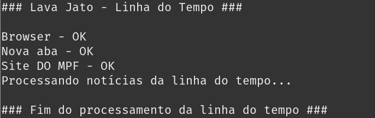

# Lava Jato - Linha do Tempo

## Softwares necessários
* Node.js - https://nodejs.org/pt-br/

## Rodando o script

### 1. Em um terminal, instalar as dependências do projeto.

    ```bash
    cd src
    npm i
    ```


### 2. Execute o arquivo timeline.js.

    ```bash
    node timeline.js
    ```

### 3. Saída esperada




### 4. Será gerado o arquivo *lavajato_linha_do_tempo.json* na pasta saída.


### 5. Caso tenha interesse, para analisar o JSON e continuar o tratamento para extrair os denunciados e crimes das notícias, execute o script *denunciados_crime.js*.

### 6. Exemplos JSON

    ```json
    [
 {
    "data": "10/09/2019",
    "titulo": "65ª fase – Galeria",
    "texto": "A operação foi deflagrada no dia 10 de setembro para aprofundar investigações sobre esquemas de corrupção e de lavagem de dinheiro relacionados à Transpetro, subsidiária da Petrobras; e à Usina Hidrelétrica de Belo Monte. As apurações apontam que, ao menos entre 2008 e 2014, Edison Lobão e Márcio Lobão solicitaram e receberam propinas dos grupos Estre e Odebrecht da ordem de R$ 50 milhões. Evidências indicam que os atos de lavagem se estendem até 2019. Nos esquemas criminosos, as provas indicam que as propinas foram entregues em espécie em escritório de advocacia ligado à família Lobão, no Rio de Janeiro.\nLeia a matéria\n",
    "linkMateria": "http://http//www.mpf.mp.br/pr/sala-de-imprensa/noticias-pr/marcio-lobao-e-preso-na-65a-fase-da-lava-jato",
    "numeros": [
      {
        "descricao": "Prisão",
        "valor": "1"
      },
      {
        "descricao": "Buscas e apreensões",
        "valor": "11"
      }
    ]
  },
  {
    "data": "25/10/2017",
    "titulo": "Processo penal nº 0507813-56 .2017.4.02.5101 (Operação Unfair Play)",
    "texto": "De acordo com a denúncia, Sérgio Cabral, Carlos Nuzman e Leonardo Gryner solicitaram diretamente a Arthur Soares e aceitaram promessa de vantagem indevida a outras pessoas, os senegaleses Papa Diack e Lamine Diack, consistente no pagamento de US$ 2 milhões para garantir votos para o Rio de Janeiro na eleição da cidade-sede dos Jogos Olímpicos de 2016, o que configura corrupção passiva. A denúncia equipara Nuzman e Gryner a funcionários públicos, uma vez que tanto o COB quanto o Comitê Organizador dos Jogos receberam e eram gestores de verbas públicas e exerciam, por delegação, uma atividade típica de Estado: o desporto.6 denunciados: Sérgio Cabral, Arthur Soares, Carlos Nuzman, Leonardo Gryner, Papa Massata Diack, Lamine DiackCrimes: corrupção ativa, corrupção passiva, organização criminosa, lavagem de dinheiro, evasão de divisas\n",
    "denunciados": "Sérgio Cabral, Arthur Soares, Carlos Nuzman, Leonardo Gryner, Papa Massata Diack, Lamine Diack",
    "crimes": "corrupção ativa, corrupção passiva, organização criminosa, lavagem de dinheiro, evasão de divisas"
  }
    ]
    ```
    

    ```json

    ```

