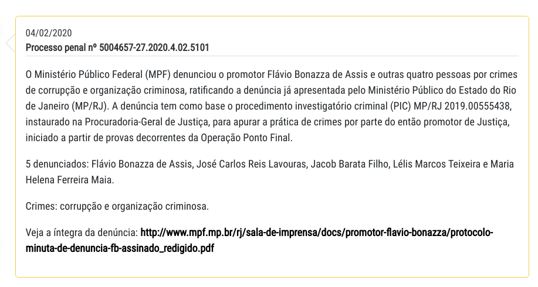
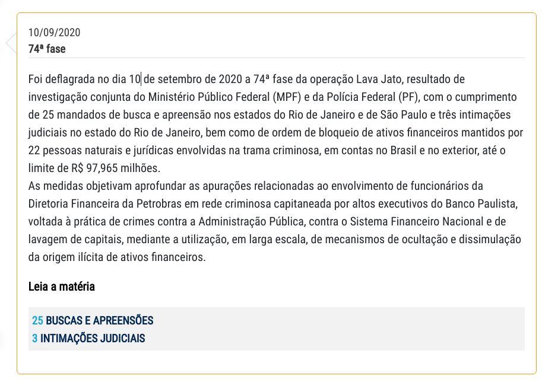

# Lava Jato - Linha do Tempo

## Softwares necessários
* Node.js - https://nodejs.org/pt-br/
* Puppeteer - https://pptr.dev/


## Rodando o script

### 1. Em um terminal, instalar as dependências do projeto.


    ```bash
    cd src
    npm i
    ```


### 2. Execute o arquivo timeline.js.

    ```bash
    node timeline.js
    ```

### 3. Saída esperada


### 4. Será gerado um arquivo json na pasta saída.

### 5. Exemplo JSON

#### Exemplo 1:

    
    ```bash
    {
    "data": "04/02/2020",
    "titulo": "Processo penal nº 5004657-27.2020.4.02.5101",
    "texto": "O Ministério Público Federal (MPF) denunciou o promotor Flávio Bonazza de Assis e outras quatro pessoas por crimes de corrupção e organização criminosa, ratificando a denúncia já apresentada pelo Ministério Público do Estado do Rio de Janeiro (MP/RJ). A denúncia tem como base o procedimento investigatório criminal (PIC) MP/RJ 2019.00555438, instaurado na Procuradoria-Geral de Justiça, para apurar a prática de crimes por parte do então promotor de Justiça, iniciado a partir de provas decorrentes da Operação Ponto Final."
  }
    ```

#### Exemplo 2:

    
    ```json
    {
        "data": "10/09/2020",
        "titulo": "74ª fase",
        "texto": "Foi deflagrada no dia 10 de setembro de 2020 a 74ª fase da operação Lava Jato, resultado de investigação conjunta do Ministério Público Federal (MPF) e da Polícia Federal (PF), com o cumprimento de 25 mandados de busca e apreensão nos estados do Rio de Janeiro e de São Paulo e três intimações judiciais no estado do Rio de Janeiro, bem como de ordem de bloqueio de ativos financeiros mantidos por 22 pessoas naturais e jurídicas envolvidas na trama criminosa, em contas no Brasil e no exterior, até o limite de R$ 97,965 milhões.As medidas objetivam aprofundar as apurações relacionadas ao envolvimento de funcionários da Diretoria Financeira da Petrobras em rede criminosa capitaneada por altos executivos do Banco Paulista, voltada à prática de crimes contra a Administração Pública, contra o Sistema Financeiro Nacional e de lavagem de capitais, mediante a utilização, em larga escala, de mecanismos de ocultação e dissimulação da origem ilícita de ativos financeiros. ",
        "linkMateria": "http://http//www.mpf.mp.br/pr/sala-de-imprensa/noticias-pr/74a-fase-da-lava-jato-investiga-esquema-em-operacoes-de-cambio-com-taxas-superfaturadas-na-petrobras",
        "numeros": [
        {
            "descricao": "BUSCAS E APREENSÕES",
            "valor": "25"
        },
        {
            "descricao": "INTIMAÇÕES JUDICIAIS",
            "valor": "3"
        }
        ]
    }    
    ```